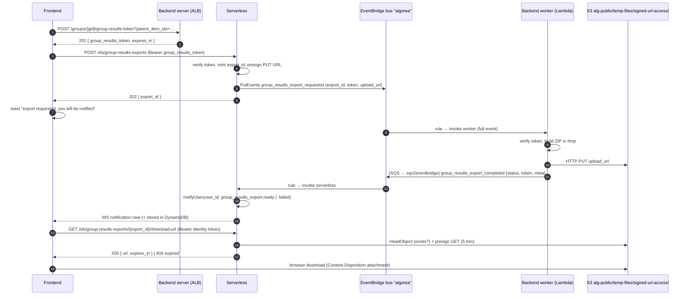

# Group Results Export

Asynchronous ZIP export of a group's progress and answers on a set of items (the former synchronous `GET /groups/{group_id}/group-progress-with-answers-zip`).

Nothing new is persisted in MySQL. A signed **group results token** carries authorization across systems, S3 stores the file, EventBridge carries the job, and the existing notification system tells the user when the file is ready.

## Problem

The synchronous endpoint builds the ZIP and streams it back in one request. The backend runs on Lambda behind an ALB:

- ALB caps Lambda responses at **1 MB** (the ZIP is easily larger),
- the `server` Lambda times out at **21 s**,
- the handler buffers the whole ZIP in memory.

The async design keeps the same product limits (100 users / 100 items) for now. The synchronous endpoint remains available but the frontend no longer uses it.

## Flow



## Trust model

- **No `export_jobs` table.** A lost or failed job is acceptable: the user re-requests.
- The **group results token** is the single authorization artifact. After verification, serverless and the worker trust it and do not re-query permissions.
- **Download URLs are minted on demand** (short-lived presigned GET) by a serverless endpoint authenticated with the **identity token**. Presigned URLs signed with Lambda role credentials die when those temporary credentials expire (hours), so a multi-day URL cannot be stored in the notification. The notification stores the export identity and expiry, not a URL.
- The backend worker never uses the S3 API: it only does a plain HTTPS PUT to the presigned URL received in the event (no redirects; see [Worker upload](#worker-upload)).
- Ownership of downloads is encoded in the S3 key (`…/<user_id>/<export_id>.zip`): serverless rebuilds the key from the identity token's `user_id` + `export_id`. No lookup table is needed.

## Shared contracts

### Group results token

Issued by the backend (`POST /groups/{group_id}/group-results-token`), signed RS512 with the same private key as identity/permissions tokens. Verified by serverless and by the backend worker with the backend public key.

Claims:

```json
{
  "user_id": "123",
  "group_id": "456",
  "item_ids": ["210", "220"],
  "date": "17-09-2026",
  "exp": 1758128400
}
```

| Claim | Notes |
|:------|:------|
| `user_id`, `group_id` | Strings (int64 as string), as for other tokens |
| `item_ids` | Validated, de-duplicated `parent_item_ids`. May be empty (ZIP then only has a header-only `group_progress.csv`). Order in the claim is significant for the upload filename (see [Presigned PUT](#presigned-put-and-filename)) |
| `date` | Set by `token.Generate`; consumers validate yesterday/today/tomorrow UTC |
| `exp` | Unix seconds. Lifetime **1 hour** (requirement ≥ 30 min; margin covers EventBridge retries) |

Meaning: user `user_id` may obtain the results (progress + answers) of group `group_id` on the subtree of `item_ids` — the same checks as the old ZIP endpoint (`CanWatchGroupMembers` and `can_watch >= answer` on every item). See also [JWS Tokens]({{ site.baseurl }}).

**Verification differs by use:**

| Where | Checks |
|:------|:-------|
| Request export (`POST /group-results-exports`) | Full JWT verify: signature + schema + `date` + `exp` |
| Completion handler (`group_results_export_completed`) | Signature + schema + `date`, **not** `exp` (the job may finish after 1 h). Implemented with `verifyJwtSignatureOnly` (`compactVerify` + `decodeJwt`): jose's normal `jwtVerify` always enforces `exp`, so it cannot be used with a "skip exp" flag. Jobs whose token `date` falls outside yesterday/today/tomorrow UTC **skip notify** |

### Serverless REST API

Prefix `/sls`, routes under `/group-results-exports`. These routes are **not** in the portal OpenAPI (same as other `/sls` routes).

#### `POST /sls/group-results-exports`

- Auth: `Authorization: Bearer <group_results_token>`
- Body (must match the token or 403):

  ```json
  { "group_id": "456", "parent_item_ids": ["210", "220"] }
  ```

  The body is redundant with the token on purpose (mirrors the former endpoint inputs and makes intent explicit). Matching is **set equality** on `group_id` and `parent_item_ids` vs token claims: order may differ; duplicates do not expand the set (`["210","210"]` ≠ `["210","220"]`). The worker still uses token `item_ids` only.

- Response `202`:

  ```json
  { "export_id": "8d3f0b7e-…", "expires_at": 1758733200000 }
  ```

  `expires_at` (ms) is the planned availability end of the file: `now + 7 days`.

- Errors: `401` (missing/invalid/expired token), `403` (body/token mismatch), `400` (invalid body), `500` (S3/EventBridge).

#### `GET /sls/group-results-exports/{export_id}/download-url`

- Auth: `Authorization: Bearer <identity_token>`
- Rebuilds the S3 key from identity `user_id` + `export_id`; a user can only mint URLs for their own exports.
- `HeadObject`; if missing → `404 { "error": "not_found" }`; otherwise presign `GetObject` with `ResponseContentDisposition: attachment; filename="…"`.
- Response `200`:

  ```json
  { "url": "https://….amazonaws.com/…?X-Amz-…", "expires_in": 300 }
  ```

- `export_id` must match `^[0-9a-f-]{36}$` (400 otherwise).

### EventBridge events

Bus: `algorea`. Envelope: existing (`version`, `type`, `source_app`, `instance`, `time`, `request_id`, `payload`).

#### `group_results_export_requested`

- Producer: serverless, directly via `PutEvents` (`Source` = `algoreaserverless.<STAGE>`).
- Consumer: backend worker `alg-backend-<stage>-worker:released` (full event as payload).
- Payload:

  ```json
  {
    "export_id": "8d3f0b7e-…",
    "token": "<group_results_token>",
    "upload_url": "https://…presigned PUT…",
    "upload_expires_at": 1758132000000
  }
  ```

  The worker takes `user_id`, `group_id`, `item_ids` from the verified token only.

#### `group_results_export_completed`

- Producer: backend worker via the existing dispatcher (SQS → `sqs2eventbridge`). Envelope schema version for this type: **1.5** (minor bump for a new event type).
- Consumer: serverless (`backend-events-for-sls` rules).
- Payload is a **discriminated union on `status`**. Serverless rejects any other shape.

**Success** — `filename` / `size_bytes` required; `error` must be `null`:

```json
{
  "export_id": "8d3f0b7e-…",
  "status": "success",
  "token": "<group_results_token>",
  "user_id": "123",
  "group_id": "456",
  "group_name": "Classe 3B",
  "items": [{ "id": "210", "title": "Chapitre 1" }],
  "filename": "groups_progress_with_answers_for_group-456-and_child_items_of-210.zip",
  "size_bytes": 12345678,
  "error": null
}
```

**Failure** — `error` required (string code); `filename` / `size_bytes` must be `null`. Codes: `too_many_users`, `too_many_items`, `token_invalid`, `upload_failed`, `internal`. Display fields (`group_name`, `items`) may still be present when generation had already loaded them (e.g. limit failures).

```json
{
  "export_id": "8d3f0b7e-…",
  "status": "failure",
  "token": "<group_results_token>",
  "user_id": "123",
  "group_id": "456",
  "group_name": "Classe 3B",
  "items": [{ "id": "210", "title": "Chapitre 1" }],
  "filename": null,
  "size_bytes": null,
  "error": "too_many_users"
}
```

Serverless uses token claims as the authoritative `user_id` / `group_id` / `item_ids` after the completion verify described above.

### Presigned PUT and filename

Serverless mints the ZIP filename with the backend naming pattern and embeds it in the presigned PUT:

```text
groups_progress_with_answers_for_group-{groupId}-and_child_items_of-{itemIds joined by -}.zip
```

`itemIds` use **token claim order** (not re-sorted). The worker must send the **same** headers the presign signed:

- `Content-Type: application/zip`
- `Content-Disposition: attachment; filename="<name>"` (exactly that form, double-quoted filename)
- `Content-Length`

Mismatch → S3 `403`.

The S3 client that creates the presign uses `requestChecksumCalculation: 'WHEN_REQUIRED'` so the PUT does **not** require AWS checksum headers; the worker's plain HTTP PUT with only the headers above succeeds.

### Worker upload

- Accepts only **`https`** `upload_url`; does not follow redirects. Non-https or `3xx` → `upload_failed`.
- Dedicated HTTP client with a **10 minute** timeout (not `http.DefaultClient`).
- Export context deadline = `min(now + 14m, upload_expires_at)` so a deferred completion dispatch can still run before the Lambda's 900 s kill. If `upload_expires_at` is already past → `upload_failed` **before** generating the ZIP.

### S3 layout

| | |
|:--|:--|
| Bucket | `alg-public` (prod), `alg-public-dev` (dev), or the beOI static bucket (`EXPORTS_BUCKET`) |
| Key | `temp-files/signed-url-access/group-results-exports/<STAGE>/<user_id>/<export_id>.zip` |
| Access | Private objects; **presigned URLs only**. Never public-read or CDN exposure |
| Retention | Announced to users: **7 days**. Lifecycle deletes at **8 days** |

`temp-files/` is covered by the 8-day lifecycle rule. `signed-url-access/` marks the subtree as presigned-URL only: CloudFront must block `/temp-files/signed-url-access*` (viewer-request → 403) so a guessed key cannot be downloaded via the static CDN. Downloads use the S3 presigned URL host, not CloudFront.

### Notifications

Pushed through the existing `notifyUser()` (DynamoDB + WebSocket `notification.new`).

**`group_results_export.ready`**

```json
{
  "exportId": "8d3f0b7e-…",
  "groupId": "456",
  "groupName": "Classe 3B",
  "items": [{ "id": "210", "title": "Chapitre 1" }],
  "filename": "groups_progress_….zip",
  "sizeBytes": 12345678,
  "expiresAt": 1758733200000
}
```

**`group_results_export.failed`**

```json
{
  "exportId": "8d3f0b7e-…",
  "groupId": "456",
  "groupName": "Classe 3B",
  "items": [{ "id": "210", "title": "Chapitre 1" }],
  "error": "too_many_users"
}
```

`expiresAt` = upload completion time + 7 days (computed by serverless when handling the completion event).

## Failure modes and UX

| Situation | What happens |
|:----------|:-------------|
| Too many users/items at token creation | Backend `400` immediately (same as the sync endpoint) |
| Too many users/items at worker time | Completion `failure` / `too_many_users` or `too_many_items` (may still include `group_name` / `items`); user gets `group_results_export.failed` |
| Unknown user in worker | `token_invalid`; other DB errors → `internal` |
| Invalid/expired token at request | Serverless `401` |
| Body ≠ token claims (set mismatch) | Serverless `403` |
| Completion token `date` outside UTC window | Serverless skips notify (no user feedback) |
| Non-https / redirect / expired upload URL / upload HTTP error | `upload_failed` |
| Other worker error | `internal` |
| Export failure after a failure completion was dispatched | Worker returns success to EventBridge so the already-notified failure is **not** retried. Export failure ≠ process failure. SQS dispatch of the completion event remains best-effort |
| Malformed requested payload but `export_id` + `token` recoverable | `handle-event` still dispatches one failure completion before exiting |
| Lost EventBridge delivery / silent failure | No notification; user re-requests |
| File past lifecycle / never uploaded | Download-url returns `404`; UI shows "Link expired" |
| User clicks ready notification | Frontend calls download-url, then navigates to the presigned URL (`Content-Disposition: attachment`). Notification is **not** deleted (multiple downloads allowed) |

## Ops checklist

Infrastructure that must be in place for this feature:

1. **S3 lifecycle** on `temp-files/` — expire after 8 days (and abort incomplete multipart uploads).
2. **CloudFront block** — viewer-request function on static distributions for path `/temp-files/signed-url-access*` returning 403.
3. **EventBridge**
   - Add `group_results_export_completed` to existing `backend-events-for-sls*` rules.
   - New rule `sls-group-results-export-requested[-<instance>]`: source `algoreaserverless.<stage>`, detail type `group_results_export_requested`, target worker Lambda `:released`, full event (no `input` transform), retry budget sized to the 1 h token / presigned PUT.
4. **Backend worker** — accept EventBridge-shaped payloads (`detail-type` present): pipe event JSON to `AlgoreaBackend handle-event` (see [Running on AWS Lambda]({{ site.baseurl }})). Consider `/tmp` ephemeral storage size for ZIP generation. Timeout stays 900 s; no extra IAM (plain HTTPS PUT).
5. **Serverless env/IAM** — `EVENT_BUS_NAME`, `EXPORTS_PREFIX`, `events:PutEvents` on the `algorea` bus, `s3:PutObject` / `s3:GetObject` on the exports prefix. `EXPORTS_BUCKET` defaults to empty in `serverless.yml` (so CI can resolve); **runtime throws if unset** — deploy must set the real bucket. Optional `EXPORTS_REGION` when the bucket is not in the Lambda region.

## Related pages

- [JWS Tokens]({{ site.baseurl }}) — token creation and validation patterns
- [Running on AWS Lambda]({{ site.baseurl }}) — worker / `handle-event`
- [Forum data model]({{ site.baseurl }}) — notification storage (DynamoDB + WebSocket)
